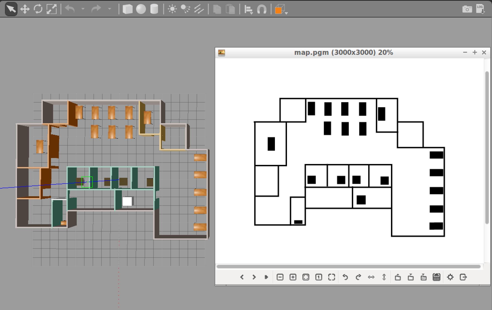

# Where Am I? 
Welcome to the Where Am I? localization project! In this project, I utilized the ROS AMCL package to accurately localize a mobile robot inside a map in the Gazebo simulation environments.

Over the course of this project, I touched several aspects of robotic software engineering with a focus on ROS:
- Created a ROS package that launches a custom robot model in a custom Gazebo world.
- Utilized the ROS AMCL package and the Tele-Operation / Navigation Stack to localize the robot.
- Explore, add, and tuned specific parameters corresponding to each package to achieve the best possible localization results.

## Github repository
https://github.com/cynepton/where-am-i

## Working with the project
### Native Installation
If you are working with a native ROS installation, some of the following package might need to be installed. You could install them as shown below:

```
sudo apt-get install ros-kinetic-navigation
sudo apt-get install ros-kinetic-map-server
sudo apt-get install ros-kinetic-move-base
sudo apt-get install ros-kinetic-amcl
```

## Project Build Process
### Catkin Workspace
To program the robot, you will need to interface it with different ROS packages. Some of these packages are official ROS packages which offer great tools and others are packages that you’ll create. The goal of this section is to prepare and build your `catkin workspace`.

Here’s the steps to building the workspace.
In your `workspaces` folder,

```
mkdir catkin_ws && cd catkin_ws
```
The `catkin_ws` name is arbitrary

```
mkdir src && cd src/
```
Initialise the workspace and build it.
```
catkin_init_workspace
catkin_make
```

### Simulation Setup 
The files from the [Go Chase it](https://github.com/cynepton/go-chase-it) project are used as a base for this one, specifically the [my_robot](https://github.com/cynepton/go-chase-it/tree/master/my_robot) package.`

Clone the Go chase it project into the `catkin_ws` workspace folder. 
```
git clone -b master https://github.com/cynepton/go-chase-it.git
```

#### Verify Your Simulation Setup
Do a quick `catkin_make` and source the `devel/setup.bash` script. Launch the world to verify if the system is good to go!

```
catkin_make
source devel/setup.bash
roslaunch my_robot world.launch
```

### Map Setup
Great! We have our simulation environment ready now. However, we cannot localize the robot just yet. The poor robot has zero information on its surroundings! Let us generate a map for it so that it knows what to expect in this environment.

Generally speaking, in the development of a robotic project, engineers utilize Mapping tools to measure and map the area robot will be operating in. Since we are developing in simulation environment the problem is simplified. We could generate the map from Gazebo world directly using a ROS package: [pgm_map_creator](https://github.com/udacity/pgm_map_creator).

**Note that currently, the map creator could not handle objects in the environment well. Please use the it with vertical surfaces only!**



#### PGM Map File
The map ROS AMCL Package uses is a `pgm` file. A `pgm` file is a grayscale image file. For more information about `pgm` file or more generally, `pnm` file, please refer to [Netpbm format Wiki Page](https://en.wikipedia.org/wiki/Netpbm_format).

By default, AMCL package will treat 'darker' pixels as obstacle in the `pgm` map file, and 'lighter' pixels as free space. The threshold could be set as a parameter which we will cover when we are building the launch file.

Navigate to your ROS package folder and create a `maps` folder. That's where your map file will reside.

```
cd /home/workspace/catkin_ws/src/<YOUR PACKAGE NAME>
mkdir maps
```

#### PGM Map Creator
**Install Dependencies**
We need `libignition-math2-dev` and `protobuf-compiler` to compile the map creator:
```
sudo apt-get install libignition-math2-dev protobuf-compiler
```

**Clone the Repository**
Clone the package `pgm_map_creator` to your `src` folder.
```
cd /catkin/path/catkin_ws/src/
git clone https://github.com/udacity/pgm_map_creator.git
```
Build the package:
```
cd ..
catkin_make
```

#### Add and Edit the World File
Copy the Gazebo world  to the `world` folder: For me, my gazebo world was [`wood.world`](https://github.com/cynepton/go-chase-it/blob/master/my_robot/worlds/wood.world) within the [`my_robot`](https://github.com/cynepton/go-chase-it/tree/master/my_robot) package.
```
cp wood.world src/pgm_map_creator/world/wood.world
```

Insert the map creator plugin to your map file. Open the map file using the editor of your choice. Add the following tag towards the end of the file, but just before `</world>` tag:
```
<plugin filename="libcollision_map_creator.so" name="collision_map_creator"/>
```

#### Create the PGM Map!
Open a terminal, run gzerver with the map file:
```
gzserver src/pgm_map_creator/world/wood.world
```
Open another terminal, launch the request_publisher node:
```
roslaunch pgm_map_creator request_publisher.launch
```

Wait for the plugin to generate map. It will be located in the map folder of the `pgm_map_creator`! Open it to do a quick check of the map. If the map is cropped, you might want to adjust the parameters in `launch/request_publisher.launch`, namely the `x` and `y` values, which defines the size of the map:
```
  <arg name="xmin" default="-15" />
  <arg name="xmax" default="15" />
  <arg name="ymin" default="-15" />
  <arg name="ymax" default="15" />
  <arg name="scan_height" default="5" />
  <arg name="resolution" default="0.01" />
```

**Edit the Map**
Remember, the map is an image, which means you could edit it using image processing softwares like `gimp` in Linux. If you have found the map not accurate due to the models, feel free to edit the `pgm` file directly!

#### Add the Map to Your Package
Now we have the map file, let us move it to where it is needed! That is the maps folder you created at the very beginning.
```
cd /home/workspace/catkin_ws/
cp src/pgm_map_creator/maps/<YOUR MAP NAME>  src/<YOUR PACKAGE NAME>/maps/<YOUR MAP NAME>
```

You would also need a `yaml` file providing the [metadata](http://wiki.ros.org/map_server#YAML_format) about the map. Create a `yaml` file next to your map:
```
cd src/my_robot/src/maps
touch map.yaml
```
*The `my_robot`  is the package name while the `map.yaml` is the map file name. Both are arbitrary*

Open the `yaml` file and add the following lines to it:
```
image: <YOUR MAP NAME>
resolution: 0.01
origin: [-15.0, -15.0, 0.0]
occupied_thresh: 0.65
free_thresh: 0.196
negate: 0
```

*Note that the origin of the map should correspond to your map's size. For example, the default map size is 30 by 30, so the origin will be [-15, -15, 0], i.e. half the size of the map.*

### AMCL Package
You learned about Monte Carlo Localization (MCL) in great detail in the previous lessons. Adaptive Monte Carlo Localization (AMCL) dynamically adjusts the number of particles over a period of time, as the robot navigates around in a map. This adaptive process offers a significant computational advantage over MCL.

The [ROS AMCL](http://wiki.ros.org/amcl) package implements this variant and you will integrate this package with your robot to localize it inside the provided map.

As you have learned in the previous projects, ROS utilizes `launch` files to run ROS nodes. In the following concepts, you will start to build the `launch` file for the AMCL package!

### AMCL launch file
First things first, create a launch file for the AMCL node in the launch folder of your package:
```
cd /home/workspace/catkin_ws/src/<YOUR PACKAGE NAME>/launch/
gedit amcl.launch 
```
Feel free to use whichever editor you prefer: `vi`, `nano`, or `gedit`.

Add the root element `<launch>` tag in the `amcl.launch` file:
```
<launch>
<!-- TODO: Add nodes here -->
</launch>
```

Great, we have the `launch` file in place! Now, let's add nodes to this `amcl.launch` file. A list of nodes is provided below as a tracker of your progress. You don't need to complete that now - come back when you have all three nodes added!

Here is the list of nodes required for AMCL package to operate:
- [Map Server Node](http://wiki.ros.org/map_server)
- [AMCL Node](http://wiki.ros.org/amcl) 
- [Move Base Node](http://wiki.ros.org/move_base)

### Map Server Node
The first node is the [`map_server` node](http://wiki.ros.org/map_server). The map_server node provides map data as a ROS service to other nodes such as the `amcl` node. Here, `map_server` node will locate the map you created in the Map Setup step and send it out as the map data.

First, add an argument of the path to your map file so that you could easily change the map loaded and avoid typing long paths again:
```
<arg name="map_file" default="$(find <YOUR PACKAGE NAME>)/maps/<YOUR MAP NAME>.yaml"/>
```

Then, add the `map_server` node, which utilizes the argument you created just now:
```
<node name="map_server" pkg="map_server" type="map_server" args="$(arg map_file)" />
```

Your amcl.launch file should look like this now:
```
<launch>

  <!-- Map Server -->
  <arg name="map_file" ... />
  <node name="map_server" ... />

</launch>
```

Nice, we have the `map_server` node set up. Let's move on to the `amcl` node.

### AMCL Node
The next node to be set up is the `amcl` node. As it was introduced in the previous concepts, it takes `odometry` and laser `scan` data to perform the AMCL localization.

#### Add `amcl` Node
First, add the amcl node in your `amcl.launch` file:
```
<launch>

  <!-- Map Server -->
  ...

  <!-- AMCL Node -->
  <node name="amcl" pkg="amcl" type="amcl" output="screen">
  </node>

</launch>
```

Ok, we created the `amcl` node. However it needs more information to localize the robot! For example, what are the sensor readings from the LiDAR?

#### Remap scan topic
By default, `amcl` package will look for the scan topic for LiDAR data. In the simulation, the Hokuyo LiDAR sensor actually publishes on the `<YOUR PACKAGE NAME>/laser/scan` topic. We will use the `remap` tag to remap the topic name `scan` to the actual topic name so that the `amcl` package could use it!

Add this remap line to your `amcl` node in the `amcl.launch` file:
```
<!-- AMCL Node -->
<node name="amcl" ...>
  <remap from="scan" to="<YOUR PACKAGE NAME>/laser/scan"/>
</node>
```

For more information on remap, check out the ROS Wiki [here](http://wiki.ros.org/roslaunch/XML/remap).

*Note: confirm the laser scan topic name the robot is publishing to before remapping, use the `rostopic list` command when the robot is launched.*

#### Add AMCL Parameters
The AMCL node also requires a set of parameters in order to connect the world (`map` frame) with the robot (`odom` frame.

Add the following parameter tags to the amcl node in the amcl.launch file:
```
<!-- AMCL Node -->
<node name="amcl" ...>
  <remap from="scan" to="<YOUR PACKAGE NAME>/laser/scan"/>
  <param name="odom_frame_id" value="odom"/>
  <param name="odom_model_type" value="diff-corrected"/>
  <param name="base_frame_id" value="robot_footprint"/>
  <param name="global_frame_id" value="map"/>
</node>
```
From the [ROS Wiki](http://wiki.ros.org/amcl), we could find the purpose of the parameters added above:
-  `odom_frame_id` (string, default: "odom"): Which frame to use for odometry
- `odom_model_type` (string, default: "diff"): Which model to use, either "diff", "omni", "diff-corrected" or "omni-corrected"
- `base_frame_id` (string, default: "base_link"): Which frame to use for the robot base
- `global_frame_id` (string, default: "map"): The name of the coordinate frame published by the localization system

Remember, AMCL package 'links' the robot (`odom` frame) with the world (`map` frame). These parameters are required for amcl package to localize the robot in the world.

#### Optional: Set Initial Position
You could use the RViz 2D Pose Estimate function to give AMCL a pose estimate as position, but you could also have it defined in the launch file.

Add the following parameters to the AMCL node, the values should correspond to your world.launch file:
```
<param name="initial_pose_x" value="<YOUR X VALUE>"/>
<param name="initial_pose_y" value="<YOUR Y VALUE>"/>
```

#### The Launch File
Now, your `amcl.launch` file should look like this:
```
<launch>

  <!-- Map Server -->
    <arg name="map_file" ... />
    <node name="map_server" ... />

  <!-- AMCL Node -->
  <node name="amcl" pkg="amcl" type="amcl" output="screen">
    <remap from="scan" to="<YOUR PACKAGE NAME>/laser/scan"/>
    <param name="odom_frame_id" value="odom"/>
    <param name="odom_model_type" value="diff-corrected"/>
    <param name="base_frame_id" value="robot_footprint"/>
    <param name="global_frame_id" value="map"/>

    <!-- If you choose to define initial pose here -->
    <param name="initial_pose_x" value="0"/>
    <param name="initial_pose_y" value="0"/>
  </node>

</launch>
```
Now, the robot has a map and the `amcl` package to localize itself. But how could it navigate to other positions to collect more information about its surroundings? `ROS Navigation Stack` is the answer.

### Move Base Node
Two nodes down, one node to go!

You will be working with the `move_base` package using which you can define a navigation goal position for your robot in the map, and the robot will navigate to that goal position. Note that this step is optional if you choose to use `teleop` node to control and localize your robot.

The `move_base` package is a very powerful tool. It utilizes a costmap - where each part of the map is divided into which area is occupied, like walls or obstacles, and which area is unoccupied. As the robot moves around, a local costmap, in relation to the global costmap, keeps getting updated allowing the package to define a continuous path for the robot to move along.

What makes this package more remarkable is that it has some built-in corrective behaviors or maneuvers. Based on specific conditions, like detecting a particular obstacle or if the robot is stuck, it will navigate the robot around the obstacle or rotate the robot till it finds a clear path ahead.

#### Add ROS `move_base` Node
Let's add the `move_base` node to the `amcl.launch` file:
```
<launch>
  <!-- Map Server -->
  ...

  <!-- AMCL Node -->
  ...

  <!-- Move Base -->
  <node name="move_base" pkg="move_base" type="move_base" respawn="false" output="screen">
  </node>

</launch>
```

#### Remap scan Topic
Again, we need to remap the `scan` topic to the correct one.

*Note: confirm the laser scan topic name the robot is publishing to before remapping, use the `rostopic list` command when the robot is launched.*
```
  <remap from="scan" to="<YOUR PACKAGE NAME>/laser/scan"/>
```

#### Add Parameters to move_base Node
Similar to the `amcl` node, `move_base` node requires a set of parameters to move the robot in the world. As we already know , we could use the `param` tag to specify the parameter. But when there are plenty of parameters, we could use the `rosparam` tag to include config files to set multiple parameters directly!

**Planners**
Add the following param tags to the `move_base` node:
```
  <param name="base_global_planner" value="navfn/NavfnROS" />
  <param name="base_local_planner" value="base_local_planner/TrajectoryPlannerROS"/>
```

#### Load Config Files
Then we need to create/get the config files and load them in the launch file:
```
cd ..
mkdir config
cd config
```

Download the `config` files from Udacity S3 bucket and add them to the `config` folder:
```
wget https://s3-us-west-1.amazonaws.com/udacity-robotics/Resource/where_am_i/config.zip
unzip config.zip
rm config.zip
```
These config files have a preset of parameters defined for you to navigate the robot if you choose to send navigation goal to the robot in testing.

#### Config Files
Now that we have the config files ready, we will include them in the launch file, in the move_base node:
```
  <rosparam file="$(find udacity_bot)/config/costmap_common_params.yaml" command="load" ns="global_costmap" />
  <rosparam file="$(find udacity_bot)/config/costmap_common_params.yaml" command="load" ns="local_costmap" />
  <rosparam file="$(find udacity_bot)/config/local_costmap_params.yaml" command="load" />
  <rosparam file="$(find udacity_bot)/config/global_costmap_params.yaml" command="load" />
  <rosparam file="$(find udacity_bot)/config/base_local_planner_params.yaml" command="load" />
```

That was a lot of work. Let us move on!

### Optional: Teleop Package
If you prefer to control your robot to help it localize itself as you did in the lab, you would need to add the `teleop` node to your package. Thanks to the ROS community, we could use `ros-teleop` package to send command to the robot using keyboard or controller.

Clone the ros-teleop package to your src folder:
```
cd /home/workspace/catkin_ws/src
git clone https://github.com/ros-teleop/teleop_twist_keyboard
```
*`home/workspace/` was my catkin_ws folder path*

Build the package and source the setup script:
```
cd ..
catkin_make
source devel/setup.bash
```

Now you could run the `teleop` script as is described in the `README` file:
```
rosrun teleop_twist_keyboard teleop_twist_keyboard.py
```

### Localization: Launching
You have your robot, your map, your localization and navigation nodes. Let’s launch it all and test it!

First, launch the simulation:
```
cd /home/workspace/catkin_ws/
roslaunch <YOUR PACKAGE NAME> <YOUR WORLD>.launch
```

In a new terminal, launch the `amcl` launch file:
```
roslaunch <YOUR PACKAGE NAME> amcl.launch
```

#### Rviz Configuration
As you did in a previous section, setup your RViz by adding the necessary displays and selecting the required topics to visualize the robot and also the map.

**Add by display type**
In Rviz,

- Select `odom` for fixed frame
- Click the “Add” button and
  - add `RobotModel`: this would add the robot itself to RViz
  - add `Map` and select first `topic/map`: the second and third topics in the list will show the global costmap, and the local costmap. Both can be helpful to tune your parameters
  - add `PoseArray` and select `topic/particlecloud`: this will display a set of arrows around the robot

Each arrow is essentially a particle defining the pose of the robot that your localization package created. Your goal is to add/tune the parameters that will help localize your robot better and thereby improve the pose array.

Note: You can save the above RViz setup in a configuration file and launch RViz with the same configuration every time. This will make the process more efficient for you! Click `file` -> `save config` to save the current configuration.

**Add by topic**
When adding elements to RViz, you could also select By `topic` tab. Here, all valid topics would be displayed and you could locate what you need faster!

#### `Transform Timeout` and `Map Update Loop`
If you received warning on `Transform Timeout` and `Map Update Loop`, you might want to configure the corresponding parameters. Namely larger `transform_tolerance` value for the AMCL node and lower `update_frequency` & `publish_frequency` values in the configuration files.

### Localization: Parameters
For the next part of the project, you will identify and tune parameters for your amcl node in the amcl.launch file, to achieve better results.

#### AMCL Parameters
The [amcl package](http://wiki.ros.org/amcl#Parameters) has a lot of parameters to select from. Different sets of parameters contribute to different aspects of the algorithm. Broadly speaking, they can be categorized into three categories - overall filter, laser, and odometry. Let’s cover some of the parameters that we recommend you start with or details to focus on.

**Overall Filter**
- `min_particles` and `max_particles` - As amcl dynamically adjusts its particles for every iteration, it expects a range of the number of particles as an input. Often, this range is tuned based on your system specifications. A larger range, with a high maximum might be too computationally extensive for a low-end system.
- `initial_pose` - For the project, you should set the position to [0, 0]. Feel free to play around with the mean yaw value.
- `update_min*` - `amcl` relies on incoming laser scans. Upon receiving a scan, it checks the values for `update_min_a` and `update_min_d` and compares to how far the robot has moved. Based on this comparison it decides whether or not to perform a filter update or to discard the scan data. Discarding data could result in poorer localization results, and too many frequent filter updates for a fast moving robot could also cause computational problems.

**Laser**
There are two different types of models to consider under this - the `likelihood_field` and the `beam`. Each of these models defines how the laser rangefinder sensor estimates the obstacles in relation to the robot.

The `likelihood_field` model is usually more computationally efficient and reliable for an environment such as the one you are working with. So you can focus on parameters for that particular model such as the -

- `laser_*_range`
- `laser_max_beams`
- `laser_z_hit` and `laser_z_rand`

Tuning of these parameters will have to be experimental. While tuning them, observe the laser scan information in RViz and try to make sure that the laser scan matches or is aligned with the actual map, and how it gets updated as the robot moves. The better the estimation of where the obstacles are, the better the localization results.

**Odometry**
`odom_model_type` - Since you are working with a differential drive mobile robot, it’s best to use the `diff-corrected` type. There are additional parameters that are specific to this type - the `odom_alphas` (1 through 4). These parameters define how much noise is expected from the robot's movements/motions as it navigates inside the map.

**Note**: The odometry information for this project is received directly from Gazebo, and is equivalent to the ground truth value (no noise expected). So, you need not have to tune these parameters and can leave them at their default values. But feel free to experiment with some values and see if you notice any changes.

**Important**: The above set of parameters should help you get started, however they aren't the only ones that can improve your results. You are encouraged and required to go through the documentation, identify which parameters might help you improve your localization results, and experiment with them. All the remaining parameters and corresponding documentation can be found on the [ROS wiki's amcl page](http://wiki.ros.org/amcl#Parameters).

Identifying and tuning all these parameters can take time and effort. But don't worry. Based on the information and resources provided, you are well-equipped to tackle the problem head-on! Make sure to discuss your approaches with your fellow students in the ND Slack, and to reach out to your mentor for any further help.

### Localization: Testing
Now, let us test the performance of your AMCL package! You have two options to control your robot while it localize itself here:

- Send `navigation goal` via RViz
- Send move command via `teleop` package.
Navigate your robot, observe its performance and tune your parameters for AMCL! Capture screenshots and include them in your project submission.

#### Option 1: Send 2D Navigation Goal
Your first option would be sending a `2D Nav Goal` from RViz. The `move_base` will try to navigate your robot based on the localization. Based on the new observation and the odometry, the robot to further perform the localization.

Click the `2D Nav Goal` button in the toolbar, then click and drag on the map to send the goal to the robot. It will start moving and localize itself in the process. If you would like to give `amcl` node a nudge, you could give the robot an initial position estimate on the map using `2D Pose Estimate`.

#### Option 2: Use teleop Node
You could also use `teleop` node to control your robot and observe it localize itself in the environment, if you have set it up in the `Optional: Teleop Package` part.

Open another terminal and launch the `teleop` script:
```
rosrun teleop_twist_keyboard teleop_twist_keyboard.py
```
You could control your robot by keyboard commands now.
